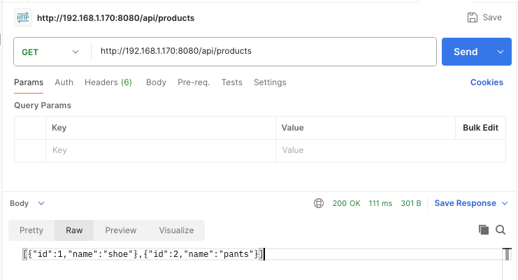
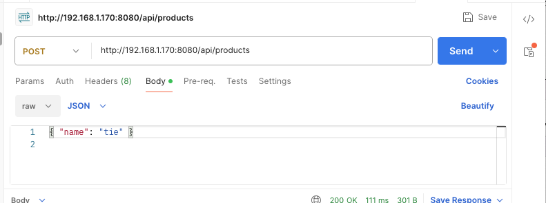
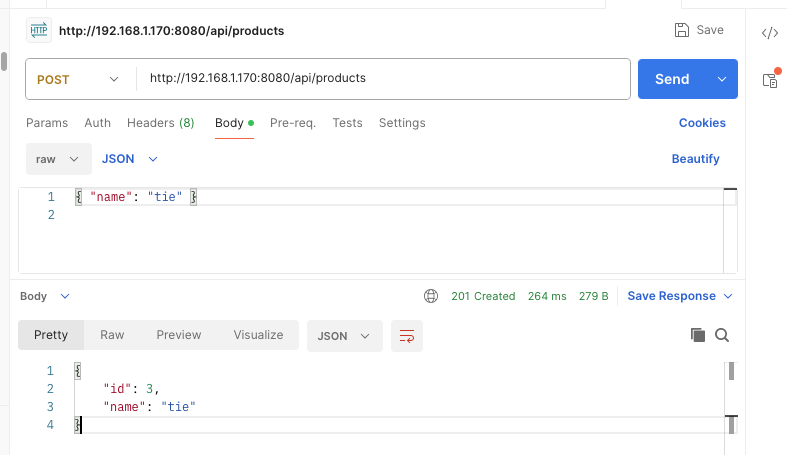

# interview-prework

A minimal Products app: list products, create a product. React (frontend) + Spring Boot
(backend) + Postgres (database), built as scaffold for a Grainger technical pairing interview.

## Prerequisites

- Docker and Docker Compose (this is all you need — `docker compose up` builds and runs every
  tier: Postgres, backend, frontend).
- Optional, only if you want to run a tier natively instead of in its container (faster
  edit/rebuild loop, e.g. during the live pairing session): Node.js 20+ and npm, JDK 21+
  (developed against 22) and Maven 3.9+.

## Database setup

Postgres runs as the `postgres` service in `docker-compose.yml`. The schema is created
automatically by a Flyway migration
(`backend/src/main/resources/db/migration/V1__create_products_table.sql`) the first time the
backend starts.

```bash
docker compose up -d
```

This starts Postgres on `localhost:5432` with database `products` (user/password `products`/`products`),
and builds/starts the `backend` and `frontend` services too (see below).

## Start backend

Starts automatically as the `backend` service above, built from `backend/Dockerfile` and run on
`http://localhost:8080`. On startup, Flyway applies the migration and creates the `products`
table if it doesn't already exist.

See [API](#api) below for the full endpoint reference.

To iterate on the backend natively instead (faster than rebuilding the image on every change):

```bash
docker compose up -d postgres
cd backend
mvn spring-boot:run
```

## Start frontend

Starts automatically as the `frontend` service above, built from `frontend/Dockerfile` and
served on `http://localhost:3000`. The container mounts `./frontend` as a volume, so Vite's dev
server still hot-reloads on source changes without rebuilding the image.

To run it natively instead:

```bash
cd frontend
npm install
npm run dev
```

## Verify

```bash
docker compose up -d
```

Open http://localhost:3000 (or `http://<host>:3000` if running on a remote server), create a
product named `P1`, and confirm it appears in the list.

## API

Base URL: `http://localhost:8080/api/products` (backend served directly), or the relative path
`/api/products` when going through the frontend's Vite dev server proxy at
`http://localhost:3000/api/products`.

### List products

```
GET /api/products
```

Returns all products.

```bash
curl http://localhost:8080/api/products
```

Response `200 OK`:

```json
[
  { "id": 1, "name": "P1" },
  { "id": 2, "name": "P2" }
]
```

### Add product

```
POST /api/products
```

Creates a product. Request body:

| Field  | Type   | Required | Notes           |
|--------|--------|----------|-----------------|
| `name` | string | yes      | Must not be blank |

```bash
curl -X POST http://localhost:8080/api/products \
  -H "Content-Type: application/json" \
  -d '{"name": "P1"}'
```

Response `201 Created`, with the saved product (including its generated `id`):

```json
{ "id": 1, "name": "P1" }
```

If `name` is missing or blank, the request is rejected with `400 Bad Request`.

### Example requests (Postman)

`GET /api/products`:



`POST /api/products` request body:



`POST /api/products` response:



## Notes

- Used the preferred stack as-is (React + Spring Boot + Postgres) — no deviation.
- `id` is a `BIGSERIAL`/`Long` identity column rather than a UUID — simplest idiomatic choice
  for Spring Data JPA given no other fields were required.
- Schema is owned by a Flyway migration (`ddl-auto: validate`) rather than Hibernate
  auto-generating/updating the schema, so the DB setup step is explicit and reviewable.
- The frontend container runs `npm run dev` (not a production build) so it keeps hot-reload
  during the pairing session; that's a deliberate departure from a normal production Dockerfile,
  acceptable given the brief's "no production hardening" scope.
- The backend container is a build-once image (no hot reload). If backend changes are needed
  live, either `docker compose up -d --build backend` or fall back to running it natively
  against the same containerized Postgres (see "Start backend").
- The frontend calls a relative `/api/...` path (not a hardcoded `http://localhost:8080`), and
  Vite's dev server proxies `/api` to the backend (`API_PROXY_TARGET`, set to
  `http://backend:8080` in `docker-compose.yml`). This is what makes the app work when opened
  from something other than `localhost` (e.g. a remote server's hostname/IP) — a hardcoded
  `localhost` API URL would resolve against the browser's machine, not the Docker host, and
  every request would fail.
- Backend CORS is wide open (`allowedOriginPatterns("*")`) rather than pinned to
  `http://localhost:3000`. The browser only ever talks to the frontend's own origin (the
  Vite proxy forwards `/api` server-side), but browsers still attach an `Origin` header to
  POST requests even when same-origin — pinning CORS to one hostname would break `createProduct`
  the moment the app is opened from anything other than `localhost`. No credentials/cookies are
  used, so a wildcard origin has no real security cost for this scaffold.

## How you built it

- Used Claude Code to scaffold both projects (Maven/Spring Boot backend, Vite/React frontend)
  and wire them together, per the brief's invitation to use AI tools and disclose it.
- Kept the API surface to exactly list + create, matching the "no update/delete" constraint.
- Containerized all three tiers in `docker-compose.yml` so `docker compose up` is the single
  command needed to get a reviewer or interviewer running — backend/frontend each get a
  Dockerfile, with Postgres gated behind a healthcheck so the backend doesn't race Flyway
  against a not-yet-ready database.
- Added one backend test (`ProductControllerTest`, `@WebMvcTest` + mocked repository) covering
  list, create, and a blank-name validation failure.
- Chose `@WebMvcTest` over `@SpringBootTest` deliberately: this test only needs to verify
  routing, status codes, and request validation on the controller, which a mocked
  `ProductRepository` is sufficient for. `@WebMvcTest` loads just the web layer (fast, ~1-2s,
  no database involved), whereas `@SpringBootTest` boots the entire application context —
  here that would mean either wiring a real Postgres connection (defeating the point of a fast
  unit-level test, and coupling `mvn test` to Docker being up) or adding an in-memory database
  purely to satisfy the test slice, which is more machinery than a 3-test suite for a
  create+list endpoint justifies. `@SpringBootTest` earns its cost once a test needs to verify
  real wiring across layers (e.g. an actual persistence round-trip) — not needed here.
- Chose a Flyway migration over `hibernate.ddl-auto=update` so the database setup step is a
  reviewable artifact rather than implicit schema generation.
- What I'd do differently with more time: add a corresponding frontend test (e.g. Vitest +
  React Testing Library) for the create-product flow, and add a `@SpringBootTest` +
  Testcontainers integration test against a real Postgres to cover the persistence layer the
  slice test intentionally mocks out.
